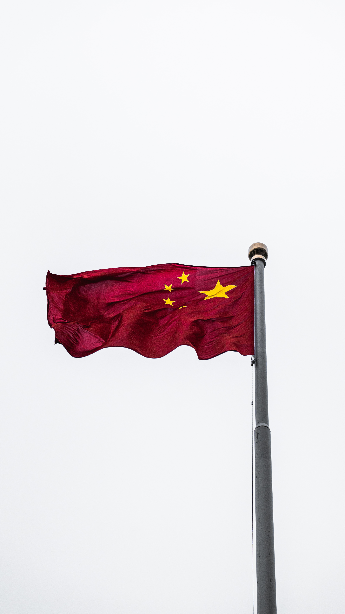

目前我国几个比较明显的行为，在国外疯狂基建：流入美元；在国内疯狂基建、发展制造业、金融、高科技、娱乐等：强化内部资金流通，强化自我实体经济，实现区别于美国的金融模式；在国际上推行人民币流通：稀释国内人民币，适当避免通货膨胀；冻结房地产：适当避免通货紧缩......

Trump 不傻，美国很厉害。在经济的紧要关头，上了一位兼顾政治、金融头脑的总统，努力在别的国家制造混乱、创造金融危机，目的就是回流美元，甚至不惜通过战争控制美元回流方向，不过他低估了中国现在的实力和自古传承下来打太极的能力。

受他国金融危机的影响，加上国内人民币流量的控制，以及国际政治、军事上对美元回流方向的控制…… 进而导致了资本在国内的波动，更多地往美国回流，也就造成了国内所谓的市场不太好。

美国开始回笼美元，也意味着接下来会剪羊毛，从几十年来美元经济发展规律就可以看出，这样的事儿已经发生好几次。所以美元经济好时，羊群中低价、高质量等特点的一定是优选，应全力配合，生命力会更旺盛，借力的道理；美元经济不好时，应该减少羊群，强化潜在美元现金流能力或稳定自我经济流通能力、储备，防止经济收紧。两种情况应该首尾衔接。（此处羊群并不是指国家）

从世界金融模式分布特点来看，一家公司的现金流体系也应该容纳两大块儿：虚拟经济（发达国家金融模式）、实体经济（发展中国家现金流模式）。从这个角度来看，片面地说，一家公司有资本角色，也有社会主义角色，才是合理的。虚拟经济提供潜在盈利的重要选型，实体经济提供可持续发展保障，根据大环境宏观调控各自分量。

所以眼下创业，或者经营公司，拿非金融行业来说，高质量产出、低价流入资金为常态的保守姿势是比较靠谱的，不能是主靠撒钱、融钱的玩法。可以积极地等待剪羊毛行为开始时侧面带来的现金洪流、金融机会。如果有条件，也可以在这时候更注重捕获来自美国的资源、市场，观察身边可合并的资源。

在国内经济好时，重小蓄，预先降低经济灾难杀伤力；在国内经济不好时，安度难关，抢占发展先机。看来即使一家创业公司，兼顾国内外金融环境、市场，是很有必要的，所谓的格局只是术，我们有责任这么做，这会让我们的事业更稳固，让我们的国家发展的更好。

不过这些都是建立在美元经济基础之上的。综上思考，咱们国家在努力掌握剪别人羊毛的能力，至少是平衡这种能力，掌控定价权，就像我们国家必须拥有核武器一样，不过总有一种感觉，打造成功的亚洲金融体系只是阶段性目标，实现我大秦帝国统一货币的目标也许是真野心。在那之后，前面的做法或许就要改变。

美国的金融模式相当于一个欠了信用卡的人，发了薪水还进去，有钱了再花出去。你想想一个人的话能承受得了大的冲击么，生个病就完了。所以美国一定会希望通过别的金融模式来掌控全局。可以进一步得出，我大中华会奋力发展区块链数字货币。

政治、资本：人、钱。天时来自于相对可观察且可以史为镜的发展规律。东风来自于事情的可控运作及随机事件。公司没了钱不可能活下去，对经济的认知何其必要。

> 融会贯通易经的道理太重要，就算当下不懂，也该熟背于心，辅助思考、权衡。一阴一阳之谓道，如果要维持不错的平衡，可持续发展下去，任何一件事儿都得找到相对的一面，并非与之对立，而是控制好分量。

> 本文仅代表作者观点，不代表格略社观点。
