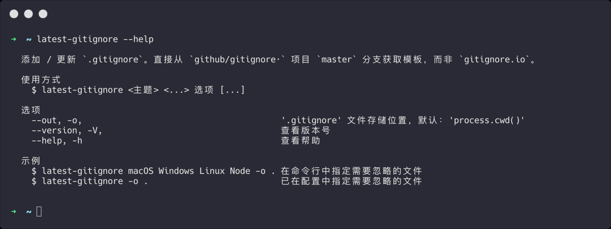
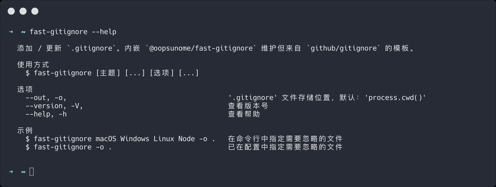

Git 项目中，通常要设置一下，确保某些文件不被提交。Git 提供了办法，那就是在项目的根目录创建 `.gitignore` 文件，把需要忽略的文件名称添加进去。

这办法操作起来很简单，但哪些文件应该被忽略，才是重点、难点，所以要好好研究、整理下。例：编辑器自动创建的文件、系统创建的临时文件、转译器缓存等，这样一来，需要忽略的文件并不少。如果一项一项地去研究，会辛苦到吐血。

值得庆幸的是，"[github/gitignore](https://github.com/github/gitignore)"，帮我们干了这件事。我们可以组合其中的模板创建 `.gitignore`。

不过这又导致了一个麻烦，😒，就是更新 `.gitignore` 环节，需要往返 "[github/gitignore](https://github.com/github/gitignore)" 项目，寻找并手动复制、粘贴模板。这会导致更新成本太高，进而造成维护意愿低迷的情况。尤其是业务驱动型作业环境下。

我们使用的操作系统、软件，它们迭代的很快，总有些它们需要但不该被提交到自己项目中的文件冒出来，如果我们大半年都不更新一次 `.gitignore` ，难免日后会无意中污染了代码仓库。

鉴于这些，写了  "[latest-gitignore](https://github.com/iTonyYo/latest-gitignore)" & "[fast-gitignore](https://github.com/iTonyYo/fast-gitignore)" 2 个命令行工具，用来自动更新项目中的 `.gitignore`。

"[latest-gitignore](https://github.com/iTonyYo/latest-gitignore)" 直接从 "[github/gitignore](https://github.com/github/gitignore)" 下载最新模板，必须联网，下载需要点时间，看你使用的模板多少。

"[fast-gitignore](https://github.com/iTonyYo/fast-gitignore)" 内嵌 “[github/gitignore](https://github.com/github/gitignore)" 模板，不一定是最新的，但定期维护，一次安装，不联网也能用，不存在下载时间，操作飞快。比较忙的时候，我自己偏好用 "[fast-gitignore](https://github.com/iTonyYo/fast-gitignore)"，不喜欢因网络导致的等待打断思路。

