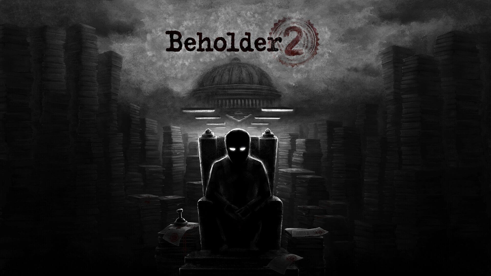
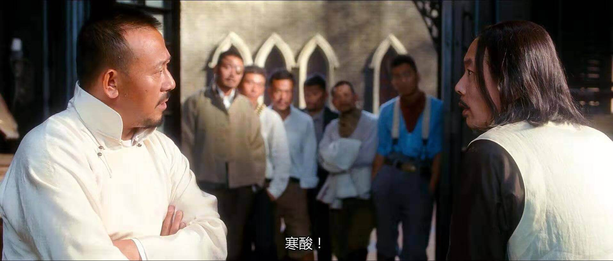

#### 游戏推荐

## 《Beholder》两部曲

> _"以前我没的选，但现在我想做个好人"_
>
> _"抱歉你现在也没得选"_

这两句话可以作为游戏 Beholder 的一种风格体现，游戏受反乌托邦小说《1984》及美苏冷战湿气的东德影响极深，构建出一个在极权国家下令人压抑的世界。 让你体会曾今真实存在于人类历史上那段暗无天日的日子的压抑与挣扎。 主人公可以做的坏事也可以做你所认为的好事，但最后的结果会因你的选择而大相近庭。总之这个游戏正真的很考验人性，说实话，玩之前我都不知道自己坏起来的时候能够这么坏。

**推荐原因有以下四点：**

- 画风讨巧，很好的掩盖了独立游戏美工部分的欠缺；

- 1984 的梗玩到飞起，还有向 paper please 等游戏致敬的内容；

- 官方自带中文，虽说是机翻，还有中文配音，官方也说会慢慢改进汉化；

- 下载平台 (Android GooglePlay Steam PC 均有该游戏)；

---

#### 音乐推荐

[《Sold Out --Hawk Nelson》](http://music.163.com/song?id=31010566&userid=344604586)

Hawk Nelson 是来自安大略省彼得堡的加拿大基督教摇滚和流行朋克乐队。该乐队成立于 2000 年，迄今已发行了八张专辑，本次推荐的歌曲便是他们 2015 年发行的专辑 《Diamonds》中的一首。

音乐在我看来没有高低好坏就像茶一样，如果一首歌和自己产生了共鸣，那它对我来说就是无与伦比的，直接扫码或者点击链接欣赏。

---

#### 电影推荐

## 《让子弹飞》

> _"如果你活着，早晚都会死；如果你死了，你就永远活着。"_

关于这部神作的解读不做赘述，相信大家在豆瓣和知乎上已经看烂了，电影中的经典台词更是数不胜数，我想从其他角度来讲讲《让子弹飞》
众所周知的，在天朝想要拍一部好电影比登天还难：政治不能碰、时事不能碰、贪污腐败不能碰、抨击社会不能碰，这里不能碰，那里不能碰，稍稍越过界就被广电老大枪毙。

严肃的没票房，观众看不懂也没耐心看完，想要又有票房又有思想又逃过广电总局的审查，几乎是不可能的。

张艺谋没做到，他输给了广电。

冯小刚没做到，他输给了观众的审美。

然而姜文做到了，这部浅的能被逗的满座欢笑，深的能让人查史深思的电影，实在是让人跪拜。

姜文是个顶聪明顶有坚持顶有梦想的一个人。
